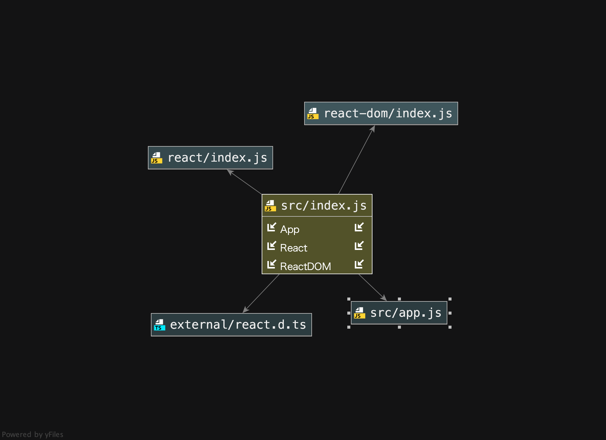

# simple_counter

## Author: Alistair Blake

### Links and Resources:
Github:  https://github.com/Alwynblake/simple_counter

AWS S3:  http://simple-counter.s3-website-us-west-2.amazonaws.com

### Feature Tasks:
* Integers increase and decrease when `+` or `-` is selected

### UML:
